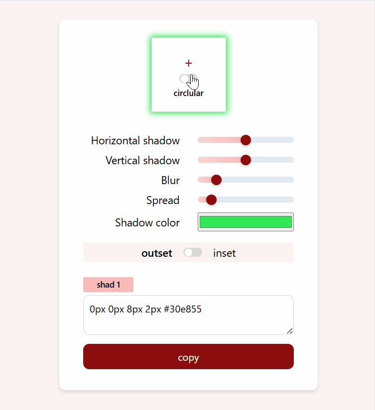

# Kingsley Ikpefan - Box Shadow Generator

## Table of contents

- [Overview](#overview)
- [The challenge](#the-challenge)
- [Screenshot](#screenshot)
- [Links](#links)
- [Built with](#built-with)
- [Author](#author)

## Overview

This is a utility web app that helps you generate values for the CSS property: box-shadow. Instead of writing CSS code for box-shadow and then start imagining the visual outcome, you can simply do it the other way round - you adjust the sliders for each part of the box-shadow value and immediately see the visual outcome on your screen. When you are okay with what you see simply click on the copy button to copy the code. You can paste it as the value for box-shadow property in your .css file and get the expected result. The app allows you to have upto 4 layers of box shadows.

## The challenge

Users should be able to:

- View the optimal layout for each page depending on their device's screen size
- See hover states for all interactive elements on the page
- Switch the shape between square and circle with a toggle button
- See the visual outcome live as they adjust the input sliders
- See and copy the css code live as the input slider is adjusted
- Add layers to or delete layers of the box-shadow
- Toggle on/off individual layers of the box-shadow's code and visual appearance

## Screenshot

## Links

- Solution URL: [solution URL](https://github.com/itksweb/ip-address-tracker)
- Live Site URL: [live site URL](https://ip-address-tracker-delta-seven.vercel.app/)

## Built with

- HTML5
- CSS3
- JavaScript

## Author

- WhatsApp - [here](https://wa.me/2348060719978)
- LinkedIn - [here](https://www.linkedin.com/in/kingsleyikpefan)
- Frontend Mentor - [here](https://www.frontendmentor.io/itksweb)

